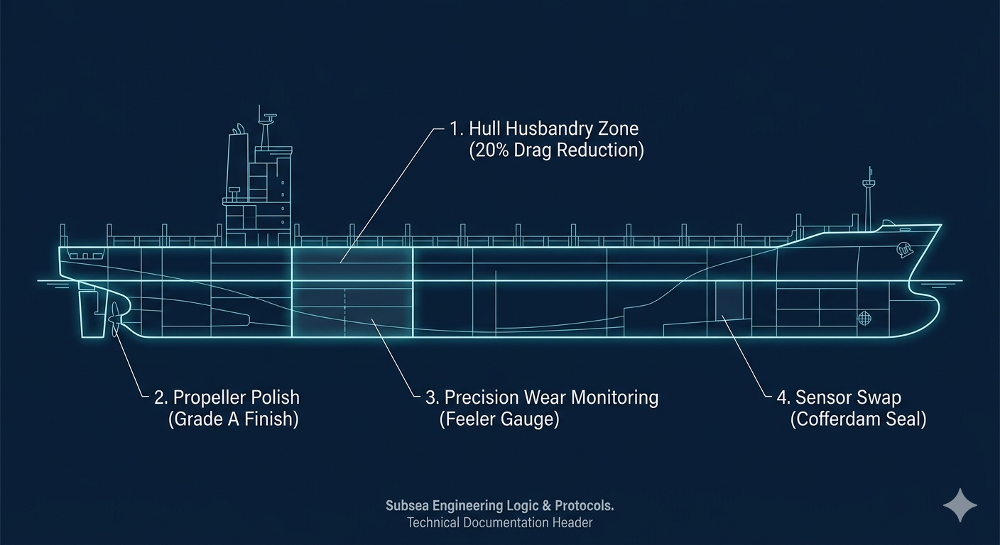

# ⚓ Working on Ships Underwater

> **Goal:** How we clean ships and fix parts under the water to save fuel and stay safe.

---

## 🛠️ Tools & Skills
* **Machines:** Underwater scrubbing karts and tools to polish metal.
* **Measuring:** Tools that can measure gaps as thin as a hair.
* **Safety:** Very strict rules for turning off engines so the diver stays safe.

---

## 🌊 What We Do

### 1. Cleaning the Bottom (Hull)
* **The Problem:** Sea grass and shells (barnacles) grow on the ship. This slows the ship down and uses **20% more fuel**.
* **The Solution:** We use a **Brush Kart**. It is like an underwater vacuum cleaner that sticks to the ship and scrubs it clean.

### 2. Making the Propeller Smooth
* **The Goal:** We polish the propeller until it is as smooth as a **mirror**.
* **The Reason:** If it is rough, it makes tiny bubbles that pop and hurt the metal. This is called **"Cavitation."**
* **The Result:** A smooth propeller helps the ship move faster and use less gas.

### 3. Safety & Measuring
* **Turning off Engines (LOTO):** We make sure all pumps and engines are locked. This stops the diver from being sucked into the ship.
* **Knocking Code:** We hit the side of the ship (**1-2-3**) to talk to the people inside the boat.
* **Exact Measuring:** We measure tiny gaps (0.05mm) to make sure the ship parts are not wearing out.

### 4. Changing Parts: "Plugging the Ship"
* **The Job:** We change speed and depth tools while the ship is still in the water.
* **The Seal:** We use a "plug" or a waterproof box on the outside so water doesn't rush into the ship.
* **The Finish:** Once the new part is in, we slowly let water back in to check for leaks.

---

## 💡 The Engineering Lesson
In underwater work, "good enough" is not okay. Whether you are fixing a giant ship or writing a computer code, being **exact** is the only way to stay safe.

---

## 🚀 Run the Code
To see how this works in a computer script, run this file:

`ship_husbandry_logic.py`
